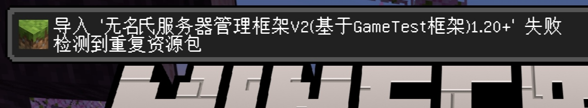
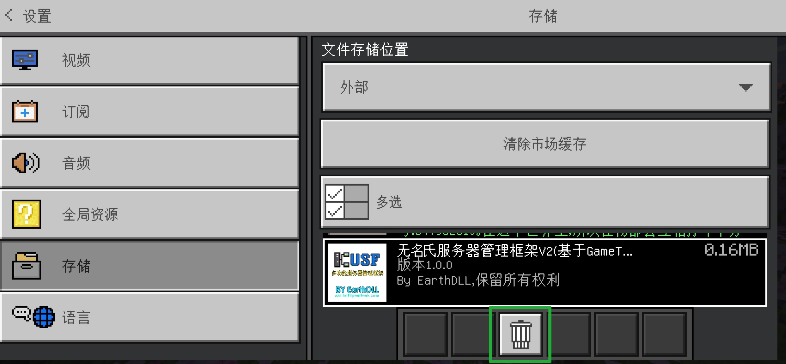
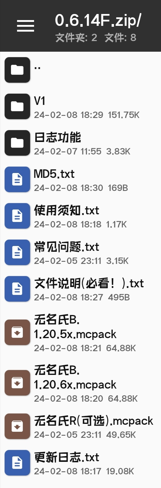
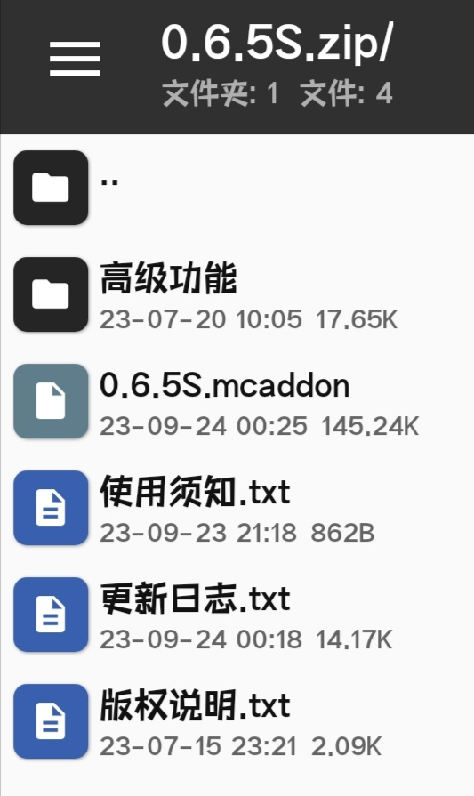
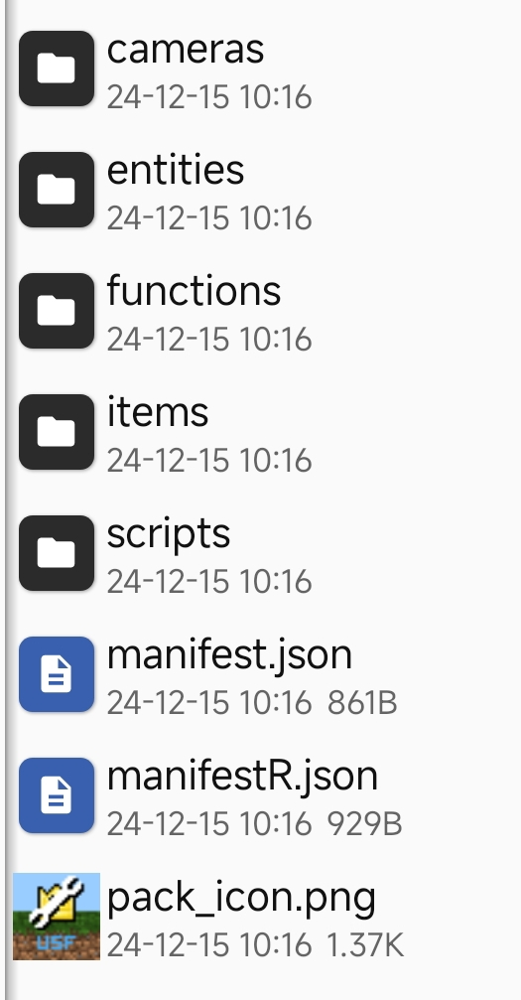
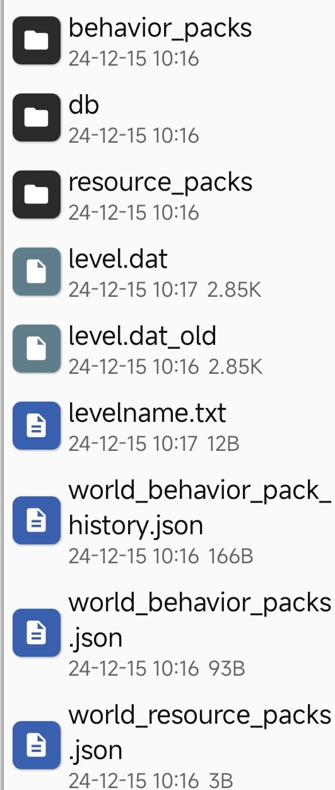

# 安装usf插件

## 本地安装USF
> [!IMPORTANT]
>若您已经导入了其他版本的USF，请删除旧版本USF的行为包，再重新导入！否则会出现以下情况：

你可以在`设置>存储>行为包`中删除其他版本的USF行为包

为了方便BDS升级插件，USF行为包的内部版本号都是「1.0.0」，因此在导入时会提示重复

文件列表如下

- `无名氏B`与`无名氏R`为V2的主包，若`无名氏B`只有一个，则直接导入即可；若有多个，请选择和游戏版本相同的包。无名氏R包包括`NPC界面优化`、`ActionBar右上角`、`表情(V2已移除)`功能，请自主选择是否导入。

> [!IMPORTANT]
> 注 R包为资源包，B包为USF本体行为包  
> 由于USF使用的美术资源绝大部分为Minecraft原版美术资源，无需二次安装R包，  所以新版USF取消了addon或者zip格式的B+R包形式  
> 如果你想添加R包(资源包)，请查看USF旧版本发布

- 若你打算安装V1，则直接导入`V1`文件夹里面的mcaddon。如果没有文件夹，则该版本没有更新V1

导入方法(0.6.10以下)
文件列表如下:

- 直接导入mcaddon文件即可  

- 新建存档/打开存档设置
- 打开实验性玩法「测试版API」
- 安装USF行为包
- 进入游戏
- 按照提示输入`/function get_owner`命令获取插件Owner
> [!IMPORTANT]
> V1各版本安装方法不同，此处仅展示「0.6.x」系列的安装方法
> 新建存档/打开存档设置
> 开启实验性玩法-测试版API
> 加载插件行为包、资源包
> 进入存档，在主世界运行命令/tickingarea add 0 0 0 0 0 0
> 根据提示输入命令`/scriptevent usf:manager`获取最高权限OP并开启插件功能

> [!WARNING]
> 要是你是用在服务器上面的话，最好先上服务器，再获取插件OP!(因为本地存档的数据和服务器上的数据不一样，你单人获取了op的话到了服务器就识别不出来了)

## 服务器安装USF

> [!WARNING]
> 需要你的服务器存档开启测试版API并开启作弊(无敌模式)
> 如果是默认存档，需要上传存档，具体方法如下：  
> 1. 打开服务器文件夹
> 2. 找到`worlds`文件夹
> 3. 找到你要上传的存档文件夹
> 4. 上传存档zip文件到`worlds`文件夹下
> 5. 解压存档zip文件
> 6. 打开服务器所在目录
> 7. 找到`server.properties`文件
> 8. 把`level-name`的值改为你上传的存档文件夹名
> 9. 重启服务器  
> 服务器具体情况可能不同，具体方法请使用百度、必应或AI

**适用范围**
* 1.服务器
* 2面板服

### 配置教程
* 首先存档打开-测试版api
* 把下载的USF插件（mcpack）解压
* 在服务器地图目录新建加behavior_packs文件夹然后在behavior_packs文件夹新建一个文件夹（名称随便）
* 把下载解压好的USF目录下所以文件复制过去（目录文件如下如下）
 

* 然后回到存档根目录在根目录下新建两个个文件
* 文件名1：world_behavior_pack_history.json
* 文件名2：world_behavior_packs.json

* 然后把以下内容复制进去
* world_behavior_pack_history.json
> [!WARNING]
> {"packs":[{"can_be_redownloaded":false,"name":"服务器管理框架V2(基于GameTest框架)1.21+","uuid":"9472c503-5a92-43c8-7ddf-0492de2362d7","version":[1,0,0]}]}
* !world_behavior_packs.json
> [!WARNING]
> [{"pack_id" : "9472c503-5a92-43c8-7ddf-0492de2362d7","version" : [ 1, 0, 0 ]}]

*把上面的信息复制进去就行了（理论上是这样未经过大量测试，有问题请反馈）

## 设置插件命令
进入路径`管理界面`-`插件设置`-`插件命令设置`，依据服务器情况自行设置  
* 主要功能  
  +cd 打开菜单  
  +op 打开插件OP界面  

* 传送功能相关  
  +tpaccept 接受传送请求   
  +tpr 随机传送  
  +back 返回死亡位置  
  +home 返回个人传送点设置的家  

* 领地功能相关  
  +land 创建领地  
  +unland 取消创建领地  

* 其他功能  
  +unsleep 显示未入睡玩家  
  +die 自杀  
  +usf 显示插件信息  

