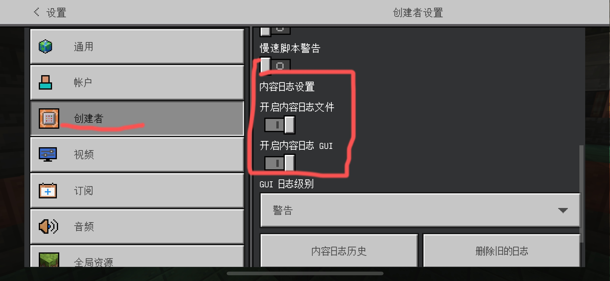

# 使用问题
治好你使用USF时的疑难杂症

## 如何获取USF
- [MineBBS官方帖下载](https://www.minebbs.com/resources/usf.5475/history)
- [官方下载站](https://usfdown.zuyst.top/)

## 如何反馈bug
1. __若无法使用USF__   
您应该检查您的Minecraft版本与usf版本是否匹配，详见[兼容表](edition.html)
然后检查是否正确安装USF  

2. __检查Bug是否修复__  
如果版本兼容，您应该查看[更新日志](change-log.html)。每个版本更新时都会修复大量bug。如果该bug已在新版本中被修复，您应该更新到最新版本。如果没有提及，您可以反馈该bug。  

3. __其它情况，需要反馈bug__  

* __进入游戏打开如下选项__   
  
* 重复出现bug的操作  
* 将出现的报错截图发到群里，最好[在Github创建issuse](https://github.com/USFrameTeam/Unknown-Server-Framework/issuses/new)   

## 其它模组/插件兼容问题  

1.假人类addon/插件  
绝大多数的假人addon/插件需要通过发送聊天信息来对假人进行操作，但这与USF有一定冲突，可能导致USF或者假人不可用。  

>[!IMPORTANT]  
>如果你想要在服务器使用假人，你将不能使用USF的头衔   
>´如:[主世界]玩家名´    

解决方案:  
在插件设置中找到USF聊天格式，关闭  

2.LeviAntiCheat插件  
目前已知ll服务端LeviAntiCheat插件可能会导致USF栈溢出，但由于LeviAntiCheat插件是闭源的，我们并不能确定相关问题  
介于服务端被watchdog关闭前是LeviAntiCheat在操作，我们暂且估计是LeviAntiCheat的部分操作可能导致USF的栈溢出  

解决方案:
不使用LeviAntiCheat插件或者不使用USF  
加强服务器管理也可以避免这种情况

## USF在服务端不加载

>[!WARNING]  
>此部分教程解决办法可能会有不确定或者需要一定操作能力/信息检索能力的部分  
>虽然这里面涵盖了部分USFrameTeam成员帮助他人时遇到的常见问题及理论解决办法  
>但USFrameTeam不对该部分教程作任何适用性承诺，如遇到不明白的部分请询问AI或向其他人寻求帮助

1. 中文文件夹  
- 问题描述:部分情况下(例如Linux Wine环境)，当behavior_packs文件夹内USF文件夹名字带有中文，USF可能不加载  
- 解决办法:删除中文  

2. 存档文件内没有USF
- 问题描述:当按照文档内教程或者Minecraft机制原因

- 问题原因：  
- 较新版本添加模组在MC私有目录的 `behavior_packs` 文件夹而非存档`behavior_packs` 文件夹  
- 在游戏本地可以正常使用USF,但一但直接导出世界没有USF(包括Windows端基岩版导出世界/世界模板、全平台基岩版直接复制存档文件夹)  

- 解决方法：  
- 检查behavior_packs文件夹内是否有USF文件，如果没有需要添加  
- 如果没有 `behavior_packs` 文件夹，你需要在存档目录新建一个 `behavior_packs` 文件夹，然后再在里面新建个名字辨识度高的文件夹(比如USF)  

- 之后将USF文件复制到 `behavior_packs/{你新建的那个}` 文件夹内，此时USF就应添加成功了

3. 部分服务商/服务端问题

- 3.1.  
- 问题描述:  
在简幻欢服务商提供的服务器中，直接在存档的worlds_behavior_packs.json里添加USF时，USF不会加载(暂未确定)   
- 解决办法:下载存档，从游戏内导入USF  

- 3.2.  
- 问题描述:  
像aternos这类免费服务商对gametest框架做了特殊的处理，导致USF无法在aternos等服务商使用  
- 解决办法: ~~我们没有太好方法~~ 只能建议更换服务商

4. 其它情况  
- 检查 `behavior_packs.json` ，查看USF UUID是否正确，如果没有 `behavior_packs.json` ，需要创建一个并按照 __json格式__ 填写USF的UUID(需要在存档开启测试版API的前提下USF通过此方法才能正常导入，没有则需开启)  
- 如果没有 `behavior_packs` 文件夹，你需要在存档目录新建一个 `behavior_packs` 文件夹，然后再在里面新建个名字辨识度高的文件夹(比如USF)  
之后将USF文件复制到 `behavior_packs/{你新建的那个}` 文件夹内，此时USF就应添加成功了

## 服务器不是OP/存档内不是OP
- 我在存档里获取了最高op，存档拷贝到服务器后，却不显示op/在服务器里是最高OP,存档下载导入后却不是OP  
- 原因：BE版游戏账户数据在本地是局域网账户，当使用xbox认证后进入服务器，数据库并没有你的信息，所以本质上服务器/存档已经有最高op了，但你却不是。

__服务器解决办法__   
- 获取 __服务器__ op：`op <你的Xbox ID>`      
- __进入服务器__，在服务器内输入`/function reset`  
- 在 __30秒内__ 在 __服务器内__ 输入`/reload`   
- 然后重新输入`/function get_owner`

__存档解决办法__
- __进入存档__，输入`/function reset`  
- 在 __30秒内__ 输入`/reload`   
- 然后重新输入`/function get_owner`

## 无法设置领地或在领地内还可以挖东西
- __无法设置领地__：检查插件设置-插件命令设置是否开启+land命令  
领地设置内计分板输入是否正确，检查计分板名是否重复
- __领地内可以挖东西__：确认领地设置，圈地为三维