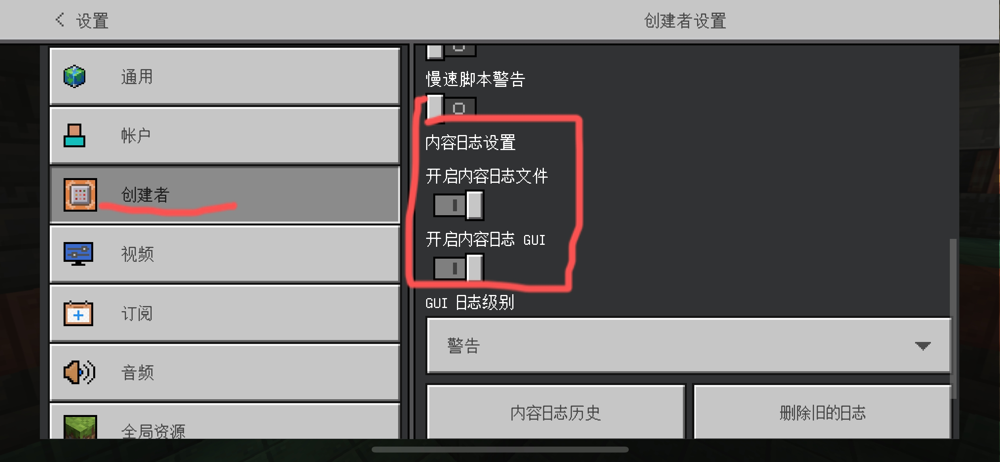
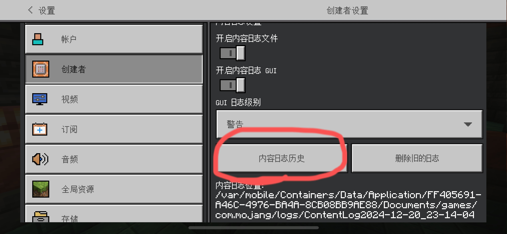
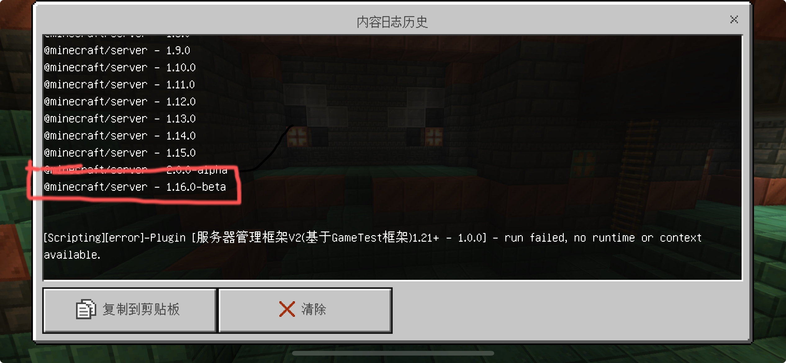
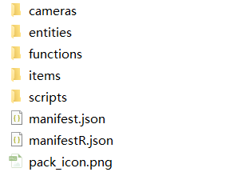
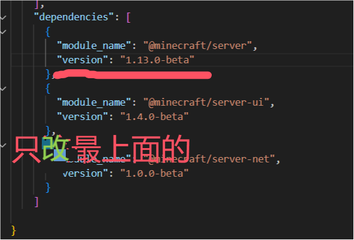

# 手动适配USF插件
* 当mc更新新新版本时，usf官方还未进行适配，你可以选择尝试自己更新usf插件

>[!warning]
>
>该教程适用于有一定开发能力的人，最好有JavaScript基础  
>使用该方法适配的USF插件可能会含有一些未知的Bug，请及时反馈

## 准备工作
你必须先有 
* 1.Minecraft Bedrock Edition  
* 2.usf插件
* 3.一台电脑（手机也可以） 
* 4.一个文本编辑器（如：MT管理器，VisualStudioCode）  
__注:Minecraft基岩版可以不使用__

## 查看@minecraft/server 版本
### 有Minecraft基岩版环境
* 将你手里面没有适配新版本的usf插件导入mc存档
* 进入设置-创建者 找到“内容日志设置”把他打开

* 打开日志功能后就进入导入好的mc存档，然后退出存档
* 再一次前往进入设置-创建者-内容日志设置 点击“内容日志历史”
* 如图得到下图

在图片中间你会发现@minecaft/server - x.x.x
在图片最下面圈起来的就是@minecraft/server版本，记住这版本号  
### 无Minecraft基岩版环境  
* 访问npmjs,搜索@minecraft/server  
    也可以通过链接访问[https://www.npmjs.com/package/@minecraft/server](https://www.npmjs.com/package/@minecraft/server)  
* 点击"Versions"  
* 找到与"Minecraft最新版本号-Stable"一致的版本号  
    如"2.2.0-beta.1.21.100-stable"  
    记住"Minecraft最新版本号-Stable"前的版本号，如示例当中的"2.2.0-beta"  
    这就是@minecraft/server的版本号  
__注：修改@minecraft/server-ui版本号同理__  

## 修改@minecraft/server api
将usf插件（xxx.mcpack）解压你会得到以下文件

* 把manifest.json和manifestR.json中的 @minecraft/server 版本更改成上面你程序到的版本号
* 保存压缩导入mc就可以所有usf插件了
  

>[!important]
>情况可能会有差异，部分情况下下面的@minecraft/server-ui版本号也要修改，方法同理

